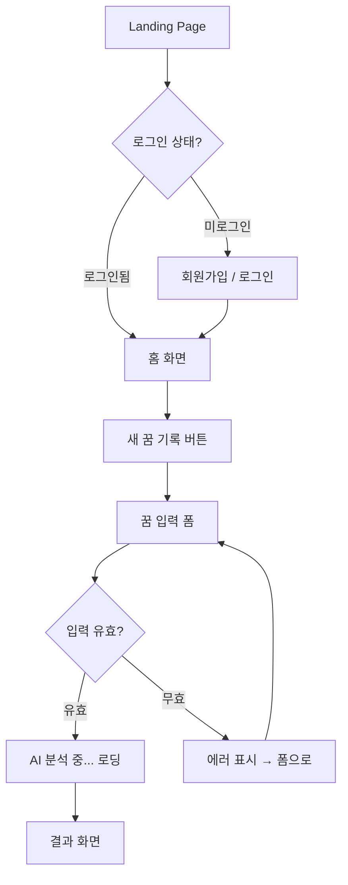
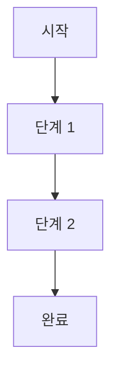

# 🖥️ Screen Flow Template (화면 흐름 + 상태 매트릭스)

`docs/screen-flow.md` 생성 시 이 템플릿을 사용. 모든 섹션을 빠짐없이 채울 것.

---

## Project Info

- **Project**: [Project Name]
- **Version**: v1.0
- **Generated**: [Date]
- **PRD Reference**: `docs/prd.md` v[N]

---

## 1. User Flow — Core Scenarios

### Scenario 1: [시나리오 제목 — 예: 신규 가입 → 첫 꿈 기록]



### Scenario 2: [시나리오 제목]



### Scenario 3~5: [추가 시나리오]
> 핵심 사용자 여정 3~5개를 다이어그램으로 작성.

---

## 2. Screen Inventory (화면 목록)

| # | 화면 이름 | 경로 | 목적 | 진입 조건 | 이탈 경로 |
|:-:|:---------|:-----|:-----|:---------|:---------|
| 1 | Landing | `/` | 제품 소개, 가입/로그인 유도 | — | 가입, 로그인 |
| 2 | Auth | `/auth` | 회원가입/로그인 | 미인증 접근 시 리다이렉트 | 홈 |
| 3 | Home | `/home` | 대시보드, 최근 활동 | 로그인 완료 | 각 기능 |
| 4 | [기능 A] | `/feature-a` | [목적] | [조건] | [경로] |
| 5 | [기능 B] | `/feature-b` | [목적] | [조건] | [경로] |

---

## 3. Interaction State Matrix

> gstack `/plan-design-review` 패턴. UI 상태별 사용자 경험을 명시.

| 기능 | ⏳ Loading | 📭 Empty | ❌ Error | ✅ Success | 🔄 Partial |
|:-----|:----------|:---------|:--------|:----------|:----------|
| **꿈 목록** | Skeleton cards (3개) | 일러스트 + "첫 번째 꿈을 기록해보세요" + CTA 버튼 | Toast + 재시도 버튼 | 카드 그리드 렌더링 | 처음 N개만 로드 + "더 보기" |
| **꿈 작성** | 버튼 비활성화 + 스피너 | — | 필드별 인라인 에러 | 성공 애니메이션 → 결과 화면 | 자동 저장 (draft) |
| **AI 분석** | 로딩 애니메이션 (우주 테마) | — | "AI 분석에 실패했습니다" + 재시도 | 분석 결과 카드 | 일부 분석만 완료 표시 |
| **프로필** | Skeleton 프로필 | 기본 아바타 + 닉네임 입력 유도 | Toast | 프로필 표시 | 이미지만 로딩 중 |
| **[기능 N]** | [상태] | [상태] | [상태] | [상태] | [상태] |

> [!IMPORTANT]
> **Empty State는 기능이다.** "No items found"는 디자인이 아님.
> 모든 Empty State에는 **따뜻함(warmth) + 주요 액션(CTA) + 맥락(context)**이 포함되어야 한다.

---

## 4. Navigation Rules

### Global Navigation

```
┌─────────────────────────────────────┐
│  Logo    [Home] [Feature] [Profile] │  ← Desktop: 상단 Nav Bar
└─────────────────────────────────────┘

┌─────────────────────────────────────┐
│           [Content Area]            │
└─────────────────────────────────────┘

┌─────────────────────────────────────┐
│  🏠 Home  ✨ Feature  👤 Profile   │  ← Mobile: 하단 Tab Bar
└─────────────────────────────────────┘
```

### Auth Guard Rules

| 페이지 유형 | 인증 필요? | 미인증 시 동작 |
|:-----------|:----------|:-------------|
| Landing (`/`) | ❌ | — |
| Marketing Pages | ❌ | — |
| Auth (`/auth`) | ❌ | 로그인 상태면 `/home`으로 리다이렉트 |
| App Pages (`/home`, `/feature-*`) | ✅ | `/auth`로 리다이렉트 (return URL 보존) |
| Settings (`/settings`) | ✅ | `/auth`로 리다이렉트 |

---

## 5. Responsive Breakpoints

| Viewport | 너비 | 레이아웃 변경 사항 |
|:---------|:-----|:-----------------|
| **Mobile** | < 640px | 단일 컬럼, 하단 탭바, 햄버거 없음 |
| **Tablet** | 640px ~ 1024px | 2컬럼 그리드, 사이드바 축소 |
| **Desktop** | > 1024px | 풀 레이아웃, 3컬럼 가능, 상단 네비게이션 |

### Mobile-First Considerations

- [ ] 터치 타겟: 최소 44x44px
- [ ] 한 손 조작 가능한 하단 CTA 배치
- [ ] 스크롤 기반 네비게이션 (무한 스크롤 / 페이지네이션 선택)
- [ ] 입력 폼: 키보드가 올라올 때 레이아웃 깨지지 않음

---

## 6. User Journey — Emotional Arc

> gstack `/plan-design-review` 패턴. 사용자의 감정 여정 설계.

| Step | User Does | User Feels | Design Supports How |
|:-----|:----------|:----------|:-------------------|
| 1 | 랜딩 페이지 도착 | 호기심 | 비주얼 히어로 + 한 줄 가치 제안 |
| 2 | 가입 시작 | 약간의 귀찮음 | 소셜 로그인 (1-click) |
| 3 | 첫 화면 진입 | 기대감 | 온보딩 가이드 + 빈 상태에 액션 유도 |
| 4 | 핵심 기능 사용 | 몰입 | 부드러운 전환 + 로딩 대기 최소화 |
| 5 | 결과 확인 | 만족 / 놀라움 | 비주얼하게 인상적인 결과 + 공유 CTA |
| 6 | 재방문 | 습관화 | 알림 + 기록 대시보드 |

---

## Notes

- 이 화면 흐름도는 `docs/prd.md`의 사용자 스토리를 UI로 번역한 것.
- API 연동 세부 사항은 `docs/api-spec.md` 참조.
- 디자인 시스템 세부 사항은 `DESIGN.md` 참조.

> [!IMPORTANT]
> 화면 흐름 변경 시 반드시 Interaction State Matrix도 함께 업데이트할 것.
