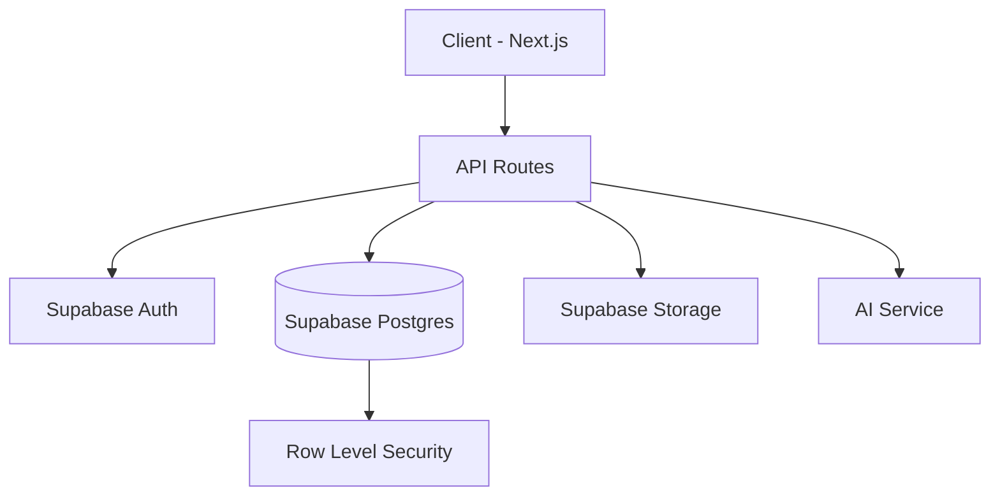

# 🔧 TRD Template (Technical Requirements Document)

`docs/trd.md` 생성 시 이 템플릿을 사용. 모든 섹션을 빠짐없이 채울 것.

---

## Project Info

- **Project**: [Project Name]
- **Version**: v1.0
- **Generated**: [Date]
- **PRD Reference**: `docs/prd.md` v[N]
- **API Spec Reference**: `docs/api-spec.md` v[N]

---

## 1. Architecture Overview

### System Diagram



> 프로젝트에 맞게 컴포넌트와 연결 관계를 수정할 것.

### Component Boundaries

| 컴포넌트 | 책임 | 의존성 | 통신 방식 |
|:---------|:-----|:------|:---------|
| [Frontend] | [UI 렌더링, 사용자 입력] | [API Routes] | [HTTP/REST] |
| [API Layer] | [비즈니스 로직, 인증] | [DB, Auth, AI] | [Server Actions / API] |
| [Database] | [데이터 영속화, RLS] | [없음] | [SQL/Supabase Client] |

---

## 2. Non-Functional Requirements

### Performance

| 항목 | 목표 | 측정 방법 |
|:-----|:-----|:---------|
| **Response Time (p95)** | < 200ms (API), < 3s (page load) | Lighthouse / APM |
| **Throughput** | [N] req/s | Load test |
| **Concurrent Users** | [N] 동시 사용자 | Stress test |
| **Database Query** | < 50ms per query | Query explain |

### Security

| 항목 | 요구사항 | 구현 방법 |
|:-----|:---------|:---------|
| **Authentication** | Bearer Token (JWT) | Supabase Auth |
| **Authorization** | Row-Level Security | Supabase RLS policies |
| **Data Encryption** | At rest + in transit | Supabase default (AES-256 + TLS) |
| **Input Validation** | All inputs validated | Zod schemas |
| **OWASP Top 10** | XSS, CSRF, Injection 방어 | CSP headers, CSRF tokens, parameterized queries |

### Accessibility

| 항목 | 목표 |
|:-----|:-----|
| **WCAG Level** | 2.1 AA |
| **Keyboard Navigation** | 모든 인터랙티브 요소 접근 가능 |
| **Screen Reader** | ARIA landmarks + labels |
| **Color Contrast** | 최소 4.5:1 비율 |
| **Touch Targets** | 최소 44x44px |

### Scalability

| 시나리오 | 대응 전략 |
|:---------|:---------|
| **10x users** | [수평 확장 / Edge caching / CDN] |
| **100x data** | [DB indexing / partitioning / archival] |
| **Bottleneck** | [예상되는 첫 번째 병목 지점 + 대응] |

---

## 3. Tech Stack Decision Matrix

| 결정 항목 | 선택 | 대안 | 선택 근거 | ADR |
|:---------|:-----|:-----|:---------|:----|
| [Framework] | [Next.js 16] | [Remix, Nuxt] | [RSC, App Router 지원] | `docs/adr/0001-*.md` |
| [Database] | [Supabase Postgres] | [Neon, PlanetScale] | [Auth + DB 통합, RLS] | `docs/adr/0002-*.md` |
| [UI Library] | [Shadcn/UI] | [Radix, Mantine] | [커스텀 가능, 접근성] | — |

> 각 결정에 대한 상세 근거는 ADR 문서 참조.

---

## 4. External Dependencies

| 서비스 | 용도 | SLA | 장애 시 Fallback | 리스크 |
|:------|:-----|:----|:----------------|:------|
| [Supabase] | Auth + DB + Storage | 99.9% | [Neon + Clerk] | 🟢 Low |
| [OpenAI API] | AI 생성 | 99.5% | [응답 캐싱 + 재시도] | 🟡 Med |
| [Vercel] | Hosting + Edge | 99.99% | [Cloudflare] | 🟢 Low |

### Lock-in Assessment

| 서비스 | 전환 난이도 | 전환 시 영향 범위 |
|:------|:-----------|:----------------|
| [Supabase] | 🟡 Medium | [Auth + DB + Storage 전체 마이그레이션] |
| [Vercel] | 🟢 Low | [next.config.js 수정 정도] |

---

## 5. Error & Rescue Map

> gstack `/plan-ceo-review` 패턴. 모든 실패 경로를 명시적으로 추적.

### Service-Level Error Map

```
METHOD/CODEPATH          | WHAT CAN GO WRONG           | EXCEPTION CLASS
-------------------------|-----------------------------|-----------------
AuthService#signIn       | Invalid credentials         | AuthError
                         | Rate limit exceeded         | RateLimitError
                         | Supabase outage             | ServiceUnavailable
-------------------------|-----------------------------|-----------------
DreamService#create      | Validation failure          | ZodError
                         | DB connection timeout       | ConnectionTimeout
                         | AI API failure              | AIServiceError
                         | Duplicate entry             | ConflictError
```

### Rescue Strategy

```
EXCEPTION CLASS          | RESCUED? | RESCUE ACTION          | USER SEES
-------------------------|----------|------------------------|------------------
AuthError                | ✅       | Show error message     | "이메일 또는 비밀번호를 확인하세요"
RateLimitError           | ✅       | Backoff + retry        | "잠시 후 다시 시도해주세요"
ServiceUnavailable       | ✅       | Retry 2x, then degrade | "일시적으로 서비스 장애"
ZodError                 | ✅       | Field-level errors     | 각 필드 아래 에러 메시지
ConnectionTimeout        | ❌ GAP   | —                      | 500 error ← NEEDS FIX
AIServiceError           | ✅       | Fallback + cache       | "AI 생성에 실패했습니다"
ConflictError            | ✅       | Show conflict message  | "이미 존재합니다"
```

> [!WARNING]
> `❌ GAP` 표시된 항목은 반드시 구현 시 rescue 로직을 추가해야 합니다.

---

## 6. Migration & Rollback Strategy

| 단계 | 작업 | 롤백 가능? | 롤백 방법 |
|:-----|:-----|:----------|:---------|
| 1 | DB Schema 생성 | ✅ | `supabase db reset` |
| 2 | RLS 정책 적용 | ✅ | Policy drop |
| 3 | API 배포 | ✅ | Vercel rollback |
| 4 | Frontend 배포 | ✅ | Vercel rollback |

---

## Notes

- 이 TRD는 `docs/prd.md`의 요구사항을 기술적으로 구현하기 위한 **계약 문서**.
- API 세부 사항은 `docs/api-spec.md` 참조.
- 데이터 모델 세부 사항은 `docs/data-model.md` 참조.

> [!IMPORTANT]
> TRD 변경 시 반드시 PRD, API Spec과의 정합성을 교차 검증할 것.
